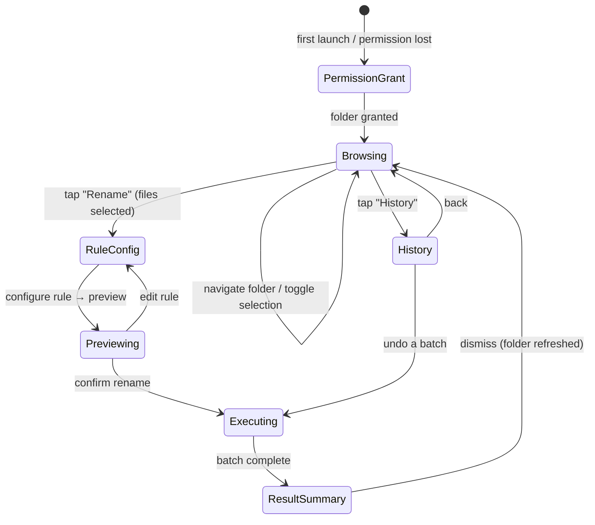
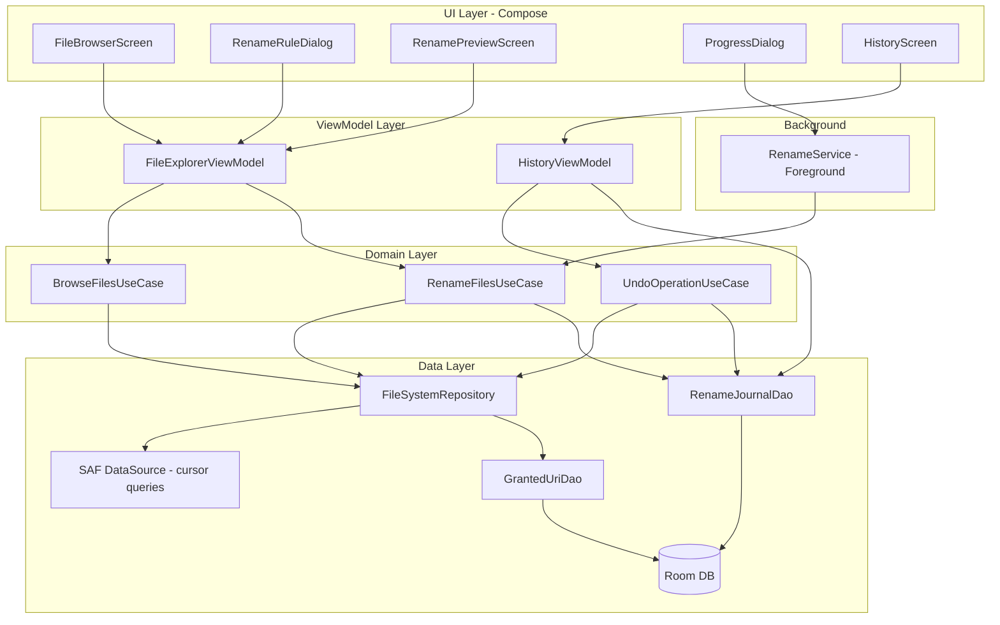

# feat: Android Bulk File Renamer

## Overview

Build a greenfield Android app that lets users browse any folder on their device, select files, and rename them in bulk with live preview, conflict resolution, and full undo history. The app integrates two tightly-coupled systems: a SAF-based file explorer and a batch rename engine with journaling.

## Problem Frame

Stock Android has no built-in bulk rename capability. Existing third-party apps suffer from poor SAF integration (repeated permission dialogs), no undo, weak conflict handling, and regex-heavy UX that alienates casual users. Users accumulate hundreds of auto-named files (IMG_*, document (17).pdf) with no practical way to organize them on mobile.

This app targets power users (5–500 file batches) who need fast, safe, reversible bulk renaming across any folder on the device.

## Requirements Trace

- R1. Browse all folders on the device via SAF (non-negotiable)
- R2. Multi-select files within the current folder (folder-scoped selection)
- R3. Apply rename rules: add prefix, add suffix, change extension, set base name, find-and-replace text
- R4. Live preview of proposed renames before commit, with conflict detection
- R5. Auto-suffix conflicting names (append _1, _2, etc.) with visibility in preview
- R6. Execute batch renames sequentially via SAF with per-file error handling
- R7. Full searchable undo history — undo any past batch; files touched by a later batch are skipped with a clear warning
- R8. Survive app backgrounding during large batches via Foreground Service
- R9. Persistent SAF permissions across app restarts; graceful recovery when permissions are revoked
- R10. No metadata writes — filename changes only

## Scope Boundaries

- No metadata reading or writing (deferred to future version)
- No cross-folder selection (selection is folder-scoped for MVP)
- No regex support in rename rules (glob-style and literal text only)
- No cloud storage integration
- No WorkManager queue (Foreground Service only for MVP; WorkManager deferred to v1.1)
- No saved templates or rule reuse (deferred to v1.1)
- No AI-powered pattern suggestions

## Context & Research

### Relevant Patterns and Constraints

- **SAF cursor queries are 10–50x faster than `DocumentFile.listFiles()`** — each `listFiles()` call triggers a separate IPC per child; `DocumentsContract` with a cursor query returns all children in one call
- **SAF renames invalidate the original URI** — `DocumentFile.renameTo()` returns a new `DocumentFile` with a different URI; the old URI is dead. Undo must use the post-rename URI stored in the journal
- **SAF renames must be sequential** — the ContentProvider IPC serializes operations; parallel calls can cause ANR in the provider process
- **Android limits persistent URI permissions to 512** (reduced to 128 on some OEMs) — must track grants in Room and release unused ones
- **API 34+ requires foreground service type** — `android:foregroundServiceType="dataSync"` must be declared in manifest
- **OEM DocumentProvider bugs** — Xiaomi, Samsung, Huawei have documented issues where `renameTo()` returns wrong URIs; validation required after each rename
- **FAT32 SD card rename** — on some providers, rename is copy-then-delete; interruption can leave both files

### Institutional Learnings

No `docs/solutions/` directory exists. This is a clean-slate project.

## Key Technical Decisions

- **Architecture: MVI + MVVM with `StateFlow`** — File operations are inherently multi-state (browsing → selecting → previewing → executing → undoing). MVI's unidirectional data flow via a single sealed `UiState` prevents the inconsistent-state bugs that plague multi-LiveData MVVM approaches. (see origin: ideation doc architecture discussion)

- **UI: Jetpack Compose** — Greenfield project; Compose's declarative model maps naturally to MVI state rendering. No legacy View code to maintain.

- **Storage: SAF-only, no MANAGE_EXTERNAL_STORAGE** — `MANAGE_EXTERNAL_STORAGE` requires Play Store policy exception review with uncertain approval. SAF via `OpenDocumentTree` grants persistent per-folder access without special permissions. The UX tradeoff (user must pick a folder once) is acceptable for a bulk renamer.

- **Folder listing: `DocumentsContract` cursor queries, not `DocumentFile.listFiles()`** — Performance difference is 10–50x for folders with 100+ files. `listFiles()` issues one IPC per child.

- **Rename execution: Sequential, not parallel** — SAF ContentProvider IPC is serialized. Parallel calls add concurrency overhead without throughput benefit and risk ANR in the provider process.

- **Batch execution: Foreground Service with progress notification** — Survives app backgrounding for 50–500 file batches. Simpler than WorkManager for MVP. WorkManager deferred to v1.1 for process-death survival.

- **Undo strategy: Journal-first with stored post-rename URI** — Each successful rename is journaled to Room before proceeding to the next file. The journal stores the new URI (returned by `renameTo()`), enabling undo by re-renaming from the new URI back to the original name. Undo is best-effort: if the file was moved or deleted externally, undo for that file fails gracefully.

- **Conflict resolution: Auto-suffix with preview visibility** — When a rename rule would produce duplicate names, automatically append `_1`, `_2`, etc. (underscore format, decided during planning). Show the suffixed name in the preview table so the user sees exactly what will happen before confirming.

- **Selection model: Folder-scoped** — Selection clears when navigating to a different folder. Avoids cross-folder URI management complexity. Standard mobile file manager pattern.

- **DI: Hilt** — Integrates with ViewModel, WorkManager (future), and Room. Standard Jetpack recommendation for new projects.

- **Database: Room** — Two tables: `rename_journal` (undo history with full-text search) and `granted_uris` (persistent permission tracking). Room's compile-time query verification prevents SQL bugs.

- **Target SDK: minSdk 26 (Android 8.0), targetSdk 35 (Android 15)** — minSdk 26 eliminates most SAF edge cases and ensures `DocumentsContract` stability. targetSdk 35 required for Play Store submission as of 2025.

- **Test framework: JUnit 5 + MockK + Robolectric** — JUnit 5 for unit tests, MockK for Kotlin-idiomatic mocking (especially `ContentResolver`), Robolectric for Android framework classes without a device.

## Open Questions

### Resolved During Planning

- **Undo scope:** Full searchable history (not single-level). User confirmed during session. Implication: Room schema needs FTS index on both pre- and post-rename names.
- **Conflict policy:** Auto-suffix with preview visibility. User confirmed during session.
- **Selection scope:** Folder-scoped. User confirmed during session.
- **Background execution:** Foreground Service for MVP. User confirmed during session.
- **Metadata:** No metadata reads or writes for MVP. User confirmed during session.

### Deferred to Implementation

- **OEM DocumentProvider validation:** Whether `renameTo()` reliably returns correct URIs on Xiaomi/Samsung/Huawei — needs testing on real devices during implementation. If unreliable, fall back to re-querying parent folder by new name.
- **Exact conflict suffix format:** Whether to use `_1` / `_2` or ` (1)` / ` (2)` — decide during UI implementation based on what looks natural in the preview table.
- **Foreground Service binding pattern:** How the Compose UI observes progress from the service — likely via a shared `StateFlow` injected by Hilt, but exact wiring depends on implementation.
- **History eviction policy:** When to prune old journal entries — defer until real usage shows whether storage is a concern. Start with no eviction.

## High-Level Technical Design

> *This illustrates the intended approach and is directional guidance for review, not implementation specification. The implementing agent should treat it as context, not code to reproduce.*

### State Machine



### Component Diagram



### Data Flow: Rename Operation

```
User configures rule → ViewModel.computePreview(selectedFiles, rule)
  → Pure function: applies rule to each file, detects conflicts, applies auto-suffix
  → Returns List<PreviewItem> with proposed names, conflict flags, validation errors
  → UI renders preview table

User confirms → ViewModel starts RenameService (Foreground)
  → Service calls RenameUseCase.executeBatch()
  → For each file (sequential):
      1. Call DocumentFile.renameTo(newName)
      2. If success: journal the rename (old URI, old name, new URI, new name, batchId)
      3. If failure: record error, continue to next file
      4. Emit progress via SharedFlow
  → On completion: emit result summary (success count, failure list)
  → ViewModel refreshes folder listing
```

## Implementation Units

- [ ] **Unit 1: Project Scaffold and Gradle Configuration**

  **Goal:** Create the Android project structure with all dependencies configured and building.

  **Requirements:** Foundation for all other units.

  **Dependencies:** None.

  **Files:**
  - Create: `build.gradle.kts` (project-level)
  - Create: `app/build.gradle.kts` (module-level)
  - Create: `settings.gradle.kts`
  - Create: `gradle.properties`
  - Create: `app/src/main/AndroidManifest.xml`
  - Create: `app/src/main/kotlin/com/bulkrenamer/BulkRenamerApp.kt` (Application class with Hilt)
  - Create: `app/src/main/kotlin/com/bulkrenamer/MainActivity.kt`
  - Create: `app/src/main/kotlin/com/bulkrenamer/di/AppModule.kt`

  **Approach:**
  - Standard Android project with single `app` module (no multi-module for MVP)
  - Kotlin 2.0+, Compose BOM for version alignment, Room with KSP annotation processing
  - Hilt for DI with `@HiltAndroidApp` application class
  - `BulkRenamerApp.onCreate()` creates a NotificationChannel for rename progress (ID: `rename_progress`, importance: `IMPORTANCE_LOW` to avoid sound during batch progress). Required for API 26+ foreground service notifications
  - Manifest declares foreground service with `dataSync` type (no storage permissions needed — SAF via `OpenDocumentTree` grants its own URI-based permissions)
  - No `MANAGE_EXTERNAL_STORAGE` permission

  **Patterns to follow:**
  - Android Gradle Plugin 8.x conventions for Compose + KSP
  - Jetpack Compose BOM for dependency version alignment

  **Test scenarios:**
  - Happy path: Project builds without errors; app launches to an empty MainActivity on emulator
  - Happy path: Hilt dependency graph compiles without missing bindings

  **Verification:**
  - `./gradlew assembleDebug` succeeds
  - App installs and launches on API 26 and API 35 emulators

---

- [ ] **Unit 2: Data Layer — Room Database, Models, and SAF Data Source**

  **Goal:** Establish the data models, Room database, DAOs, and the SAF cursor-based file listing.

  **Requirements:** R1 (browse all folders), R7 (undo history), R9 (persistent permissions)

  **Dependencies:** Unit 1

  **Files:**
  - Create: `app/src/main/kotlin/com/bulkrenamer/data/model/FileNode.kt`
  - Create: `app/src/main/kotlin/com/bulkrenamer/data/model/RenameRule.kt`
  - Create: `app/src/main/kotlin/com/bulkrenamer/domain/RenamePreviewItem.kt`
  - Create: `app/src/main/kotlin/com/bulkrenamer/data/model/RenameResult.kt`
  - Create: `app/src/main/kotlin/com/bulkrenamer/data/db/AppDatabase.kt`
  - Create: `app/src/main/kotlin/com/bulkrenamer/data/db/RenameJournalEntity.kt`
  - Create: `app/src/main/kotlin/com/bulkrenamer/data/db/RenameJournalDao.kt`
  - Create: `app/src/main/kotlin/com/bulkrenamer/data/db/GrantedUriEntity.kt`
  - Create: `app/src/main/kotlin/com/bulkrenamer/data/db/GrantedUriDao.kt`
  - Create: `app/src/main/kotlin/com/bulkrenamer/data/repository/FileSystemRepository.kt`
  - Test: `app/src/test/kotlin/com/bulkrenamer/data/model/RenameRuleTest.kt`
  - Test: `app/src/test/kotlin/com/bulkrenamer/data/model/RenamePreviewTest.kt`
  - Test: `app/src/androidTest/kotlin/com/bulkrenamer/data/db/RenameJournalDaoTest.kt`

  **Approach:**
  - `FileNode` is an immutable data class holding document ID, tree URI, document URI, name, MIME type, size, last modified, and SAF flags. Derived properties: `isDirectory`, `isRenameable`, `extension`, `nameWithoutExtension`
  - `RenameRule` is a sealed class with subclasses: `AddPrefix`, `AddSuffix`, `ChangeExtension`, `SetBaseName`, `ReplaceText`. Each has an `apply(FileNode): String` method. (`Composite` deferred to v1.1)
  - `FileSystemRepository.listChildren(folderUri)` uses `DocumentsContract.buildChildDocumentsUriUsingTree` with a cursor query projecting document ID, display name, MIME type, size, last modified, and flags — single IPC call for the entire folder
  - Room database version 1 with two entities: `RenameJournalEntity` (with FTS4 virtual table for full-text search on original and new filenames) and `GrantedUriEntity`
  - `RenameJournalDao` supports: insert single entry, query by batch ID, query recent batches, full-text search by filename, mark batch as undone
  - `GrantedUriDao` supports: insert, delete, count (for quota tracking)
  - Preview computation is a pure function on `RenameRule` + `List<FileNode>` → `List<RenamePreviewItem>`, detecting conflicts and applying auto-suffix

  **Patterns to follow:**
  - Room entity + DAO pattern from Jetpack documentation
  - `withContext(Dispatchers.IO)` for all ContentResolver calls
  - `limitedParallelism(1)` dispatcher for rename operations

  **Test scenarios:**
  - Happy path: `AddPrefix("2024_")` applied to `FileNode(name="photo.jpg")` returns `"2024_photo.jpg"`
  - Happy path: `AddSuffix("_backup", beforeExtension=true)` applied to `photo.jpg` returns `"photo_backup.jpg"`
  - Happy path: `ChangeExtension("png")` applied to `photo.jpg` returns `"photo.png"`
  - Happy path: `SetBaseName("vacation")` applied to `photo.jpg` returns `"vacation.jpg"`
  - Happy path: `ReplaceText("IMG_", "Photo_")` applied to `IMG_001.jpg` returns `"Photo_001.jpg"`
  - Happy path: `Composite([AddPrefix("2024_"), AddSuffix("_v2")])` chains rules correctly
  - Edge case: `AddSuffix` on file with no extension appends directly to name
  - Edge case: `ChangeExtension("")` strips the extension entirely
  - Edge case: `ReplaceText` with case-insensitive flag matches regardless of case
  - Edge case: `SetBaseName` applied to a directory ignores the "keep extension" flag
  - Edge case: Preview detects conflict when two files would get the same name and applies auto-suffix `_1`, `_2`
  - Edge case: Preview flags validation error for empty proposed name, name containing `/`, name exceeding 255 characters
  - Edge case: Preview marks files as "unchanged" when the rule produces the same name
  - Integration: `RenameJournalDao` — insert 3 entries for a batch, query by batchId returns all 3, mark as undone excludes them from subsequent queries
  - Integration: `RenameJournalDao` — full-text search for "photo" matches entries where either original or new name contains "photo"

  **Verification:**
  - All unit tests pass for rename rules and preview computation
  - Room schema compiles and DAO instrumented tests pass on emulator

---

- [ ] **Unit 3: File Explorer ViewModel and Navigation**

  **Goal:** Implement the ViewModel layer that drives folder browsing, navigation, selection state, and the transition to rename preview.

  **Requirements:** R1 (browse folders), R2 (multi-select), R4 (live preview)

  **Dependencies:** Unit 2

  **Files:**
  - Create: `app/src/main/kotlin/com/bulkrenamer/ui/state/FileExplorerUiState.kt`
  - Create: `app/src/main/kotlin/com/bulkrenamer/ui/viewmodel/FileExplorerViewModel.kt`
  - Create: `app/src/main/kotlin/com/bulkrenamer/domain/BrowseFilesUseCase.kt`
  - Test: `app/src/test/kotlin/com/bulkrenamer/ui/viewmodel/FileExplorerViewModelTest.kt`

  **Approach:**
  - `FileExplorerUiState` is a sealed class with states: `Loading`, `Browsing`, `PermissionRequired`, `RenamePreviewing`, `RenameInProgress`, `RenameResult`, `Error`
  - `FileExplorerViewModel` holds a `MutableStateFlow<UiState>` and processes user intents: navigateTo, navigateUp, toggleSelection, selectAll, deselectAll, previewRename, confirmRename, dismissResult
  - Navigation stack persisted via `SavedStateHandle` — list of URI strings, survives process death
  - Selection is folder-scoped: cleared on folder navigation
  - `BrowseFilesUseCase` wraps `FileSystemRepository.listChildren()` with sorting (folders first, then alphabetical)
  - SAF permission grant flow: when no persisted URIs exist or all are invalid, emit `PermissionRequired` state. UI launches `OpenDocumentTree` intent and feeds result back to ViewModel
  - Stale permission recovery: on app launch, verify each persisted URI is still valid via `contentResolver.persistedUriPermissions`. If invalid, remove from `GrantedUriDao` and emit `PermissionRequired`

  **Patterns to follow:**
  - `SavedStateHandle.getStateFlow()` for navigation stack persistence
  - `viewModelScope.launch` for async folder loading
  - Emit `Loading` before async work, `Error` on failure

  **Test scenarios:**
  - Happy path: `navigateTo(folderUri)` emits `Loading` then `Browsing` with file entries
  - Happy path: `navigateUp()` pops the stack and loads the parent folder
  - Happy path: `toggleSelection(id)` adds to selection; toggle again removes
  - Happy path: `selectAll()` selects all non-directory entries; `deselectAll()` clears
  - Happy path: `previewRename(rule)` with selected files emits `RenamePreviewing` with preview items
  - Edge case: `navigateUp()` when stack has one entry returns false (can't go higher)
  - Edge case: `navigateTo()` clears selection from previous folder
  - Edge case: Folder load failure emits `Error` with recoverable=true
  - Edge case: No persisted URIs on launch emits `PermissionRequired`
  - Edge case: Persisted URI is stale — detected, removed, `PermissionRequired` emitted
  - Integration: Selection state survives `SavedStateHandle` round-trip (simulated process death)

  **Verification:**
  - ViewModel unit tests pass with mocked repository
  - State transitions match the state machine diagram

---

- [ ] **Unit 4: File Explorer Compose UI**

  **Goal:** Build the Compose screens for folder browsing, file selection, SAF permission grant, and stale-permission recovery.

  **Requirements:** R1 (browse all folders), R2 (multi-select), R9 (persistent permissions, graceful recovery)

  **Dependencies:** Unit 3

  **Files:**
  - Create: `app/src/main/kotlin/com/bulkrenamer/ui/screen/FileBrowserScreen.kt`
  - Create: `app/src/main/kotlin/com/bulkrenamer/ui/screen/PermissionScreen.kt`
  - Create: `app/src/main/kotlin/com/bulkrenamer/ui/component/FileItem.kt`
  - Create: `app/src/main/kotlin/com/bulkrenamer/ui/component/SelectionToolbar.kt`
  - Modify: `app/src/main/kotlin/com/bulkrenamer/MainActivity.kt`
  - Test: `app/src/androidTest/kotlin/com/bulkrenamer/ui/screen/FileBrowserScreenTest.kt`

  **Approach:**
  - `FileBrowserScreen` renders a `LazyColumn` of `FileItem` composables keyed by document ID. Toolbar shows current path, back button (when `canGoUp`), and selection count
  - `FileItem` shows: checkbox (when in selection mode), file icon (folder vs file type), filename, file size (human-readable), last modified date. Tap toggles selection; long-press or tap on folder navigates into it
  - `SelectionToolbar` appears when 1+ files selected: shows count, "Select All", "Deselect All", and "Rename" button
  - `PermissionScreen` shown on first launch or when permission is stale: explains why folder access is needed, has "Grant Access" button that launches `OpenDocumentTree`, handles cancel gracefully
  - Empty folder state: centered message "This folder is empty"
  - Loading state: centered circular progress indicator
  - Error state: message with "Retry" button
  - Subfolders shown alongside files but not selectable for rename — tapping a folder navigates into it

  **Patterns to follow:**
  - `collectAsStateWithLifecycle()` for ViewModel state observation
  - `rememberLauncherForActivityResult(ActivityResultContracts.OpenDocumentTree())` for SAF intent
  - Material 3 components for consistent Android look

  **Test scenarios:**
  - Happy path: Screen renders file list matching ViewModel state
  - Happy path: Tapping a file toggles its checkbox
  - Happy path: Tapping a folder navigates into it (does not select it)
  - Happy path: "Grant Access" button launches SAF picker
  - Edge case: Empty folder shows empty state message
  - Edge case: Loading state shows progress indicator
  - Edge case: Permission screen shown when no URIs granted
  - Edge case: Back button disabled at root of granted tree

  **Verification:**
  - Compose preview renders correctly for each state
  - Instrumented tests pass on emulator with mock ViewModel

---

- [ ] **Unit 5: Rename Rule Configuration and Preview UI**

  **Goal:** Build the rename rule configuration dialog and the preview screen showing proposed changes with conflict indicators.

  **Requirements:** R3 (rename rules), R4 (live preview), R5 (conflict auto-suffix)

  **Dependencies:** Unit 3, Unit 4

  **Files:**
  - Create: `app/src/main/kotlin/com/bulkrenamer/ui/screen/RenameRuleDialog.kt`
  - Create: `app/src/main/kotlin/com/bulkrenamer/ui/screen/RenamePreviewScreen.kt`
  - Create: `app/src/main/kotlin/com/bulkrenamer/ui/component/PreviewItem.kt`
  - Test: `app/src/androidTest/kotlin/com/bulkrenamer/ui/screen/RenamePreviewScreenTest.kt`

  **Approach:**
  - `RenameRuleDialog` is a bottom sheet or full-screen dialog. User selects rule type from a segmented control (Prefix, Suffix, Extension, Base Name, Replace). Input fields appear based on type. For Suffix: toggle "before extension" checkbox. For Replace: two fields (find, replace) + case-sensitive toggle
  - As user types, ViewModel recomputes preview in real-time (debounced ~300ms) — no I/O, pure function
  - `RenamePreviewScreen` shows a scrollable list of `PreviewItem` composables. Each shows: original name → proposed name. Conflict items highlighted with warning color and show the auto-suffixed name. Validation errors shown in red. Unchanged items shown dimmed
  - Header shows summary: "X files will be renamed, Y conflicts auto-resolved, Z unchanged"
  - "Confirm Rename" button at bottom — disabled if any validation errors exist
  - "Back to Edit" button returns to rule configuration

  **Patterns to follow:**
  - Material 3 `ModalBottomSheet` or `FullScreenDialog` for rule configuration
  - `LazyColumn` with item keys for preview list

  **Test scenarios:**
  - Happy path: Selecting "Prefix" type shows prefix input field; typing updates preview in real-time
  - Happy path: Preview shows original → proposed name for each selected file
  - Happy path: Conflicting names show auto-suffixed result with warning indicator
  - Edge case: Empty input field shows all files as "unchanged" (no-op preview)
  - Edge case: Invalid characters in input show validation error in preview items
  - Edge case: "Confirm" button disabled when validation errors exist
  - Edge case: Rule type switch clears previous input and recomputes preview

  **Verification:**
  - Preview accurately reflects rule application for all 5 rule types
  - Conflict auto-suffix visible in preview before user confirms

---

- [ ] **Unit 6: Batch Rename Execution with Foreground Service**

  **Goal:** Execute bulk renames sequentially via SAF in a Foreground Service with progress notification, per-file error handling, and journal writes.

  **Requirements:** R6 (sequential batch rename), R7 (journal for undo), R8 (survive backgrounding)

  **Dependencies:** Unit 2, Unit 3

  **Files:**
  - Create: `app/src/main/kotlin/com/bulkrenamer/domain/RenameFilesUseCase.kt`
  - Create: `app/src/main/kotlin/com/bulkrenamer/service/RenameService.kt`
  - Create: `app/src/main/kotlin/com/bulkrenamer/service/RenameProgressState.kt`
  - Create: `app/src/main/kotlin/com/bulkrenamer/ui/component/RenameProgressDialog.kt`
  - Create: `app/src/main/kotlin/com/bulkrenamer/ui/screen/RenameResultScreen.kt`
  - Test: `app/src/test/kotlin/com/bulkrenamer/domain/RenameFilesUseCaseTest.kt`

  **Approach:**
  - `RenameService` is a bound Foreground Service (`FOREGROUND_SERVICE_TYPE_DATA_SYNC`). It receives the list of rename operations, starts foreground with a progress notification, and delegates to `RenameFilesUseCase`
  - `RenameFilesUseCase.executeBatch()` iterates files sequentially on `Dispatchers.IO`:
    1. Call `DocumentFile.renameTo(newName)` — may return null on failure
    2. On success: insert `RenameJournalEntry` with the *new* URI (critical for undo)
    3. On failure: record error, continue to next file
    4. Emit progress via a `SharedFlow<RenameProgressState>`
  - Progress notification updates after each file: "Renaming 15 of 200..."
  - On completion: emit `RenameResultState` with success count, failure list, batch ID
  - `RenameProgressDialog` in Compose observes the service's progress flow and shows a progress bar + current file name + cancel button
  - Cancel: sets a cancellation flag checked between files; does not attempt to undo already-renamed files
  - Result summary screen: shows "X renamed, Y failed" with expandable failure list. Provides "Undo" button for immediate reversal

  **Execution note:** The journal insert must happen *after* successful rename but *before* proceeding to the next file. This ensures undo data is durable even if the process dies mid-batch.

  **Patterns to follow:**
  - `startForeground()` with notification channel and `ServiceInfo.FOREGROUND_SERVICE_TYPE_DATA_SYNC`
  - Hilt `@AndroidEntryPoint` for service injection
  - `StateFlow<RenameProgressState>` for progress emission — progress is state (current index, total), not events; `StateFlow` ensures a collector joining mid-batch gets the latest state immediately

  **Test scenarios:**
  - Happy path: 5-file batch — all succeed, journal contains 5 entries with correct batch ID, progress emitted 5 times
  - Happy path: Progress notification shows incrementing count
  - Error path: File 3 of 5 fails (simulated `renameTo` returns null) — files 1-2 and 4-5 renamed, file 3 logged as error, journal contains 4 entries
  - Error path: All files fail — result summary shows 0 success, N failures
  - Edge case: Cancel mid-batch — already-renamed files stay renamed, remaining files skipped, journal contains only completed renames
  - Edge case: `renameTo` returns DocumentFile with different URI — journal stores the new URI, not the original
  - Edge case: Process dies after file 3 — journal contains files 1-3; on next launch, batch shows as partially complete in history
  - Integration: Foreground Service starts, shows notification, processes batch, stops self on completion

  **Verification:**
  - Unit tests pass with mocked `FileSystemRepository`
  - Foreground Service starts and stops correctly on emulator
  - Progress notification visible during batch execution

---

- [ ] **Unit 7: Undo System — History, Search, and Batch Reversal**

  **Goal:** Implement full undo history with search, supporting reversal of any past batch.

  **Requirements:** R7 (full searchable undo history)

  **Dependencies:** Unit 2, Unit 6

  **Files:**
  - Create: `app/src/main/kotlin/com/bulkrenamer/domain/UndoOperationUseCase.kt`
  - Create: `app/src/main/kotlin/com/bulkrenamer/ui/viewmodel/HistoryViewModel.kt`
  - Create: `app/src/main/kotlin/com/bulkrenamer/ui/screen/HistoryScreen.kt`
  - Create: `app/src/main/kotlin/com/bulkrenamer/ui/component/HistoryItem.kt`
  - Test: `app/src/test/kotlin/com/bulkrenamer/domain/UndoOperationUseCaseTest.kt`

  **Approach:**
  - `UndoOperationUseCase.undoBatch(batchId)` loads journal entries for the batch, constructs reverse-rename operations (using stored new URIs), and executes them sequentially. Marks the original batch as undone in the journal. The undo operation itself is *not* journaled as a separate batch (to avoid infinite undo chains)
  - If a file's stored URI is invalid (file moved/deleted externally), that file's undo fails gracefully — recorded in the undo result, other files still undo
  - `HistoryViewModel` provides: list of recent batches (paginated), search by filename (FTS query on both original and new names), filter by date range
  - `HistoryScreen` shows a list of past batches. Each item shows: timestamp, file count, rule description (e.g., "Added prefix '2024_'"), status (active / undone). Tapping a batch shows detail view with all file mappings. "Undo" button available on active batches
  - Undone batches shown with strikethrough styling but remain in history for audit
  - Search bar at top searches both original and new filenames across all batches

  **Patterns to follow:**
  - Room FTS4 virtual table for full-text search
  - Paging 3 library for paginated history list (optional for MVP; simple `Flow<List>` acceptable)
  - `HistoryViewModel` separate from `FileExplorerViewModel` to keep concerns clean

  **Test scenarios:**
  - Happy path: Undo a 3-file batch — all files renamed back to original names, batch marked as undone
  - Happy path: Search "photo" returns batches where any file's original or new name contains "photo"
  - Happy path: History list shows batches in reverse chronological order with correct file counts
  - Error path: Undo a batch where 1 of 3 files was externally deleted — 2 files undo, 1 reported as failed, batch still marked as undone
  - Error path: Attempt to undo an already-undone batch — rejected with clear message
  - Edge case: Undo a batch from 2 weeks ago where intervening renames touched the same files — undo uses stored URIs which may now point to the wrong file. Validate file name matches expected "new name" before reversing; skip if mismatch
  - Edge case: Empty history — screen shows "No rename history yet"
  - Integration: Full round-trip — rename 5 files, verify history shows batch, undo batch, verify files have original names, verify batch shows as "undone" in history

  **Verification:**
  - Undo correctly reverses a batch using stored post-rename URIs
  - FTS search returns relevant results
  - History UI shows correct batch statuses

---

- [ ] **Unit 8: Integration Wiring and Navigation**

  **Goal:** Wire all screens together with navigation, connect ViewModels to the service and database, and handle the complete user journey end-to-end.

  **Requirements:** All — this unit integrates the complete flow.

  **Dependencies:** Units 1–7

  **Files:**
  - Modify: `app/src/main/kotlin/com/bulkrenamer/MainActivity.kt`
  - Create: `app/src/main/kotlin/com/bulkrenamer/ui/navigation/AppNavGraph.kt`
  - Modify: `app/src/main/kotlin/com/bulkrenamer/di/AppModule.kt`
  - Test: `app/src/androidTest/kotlin/com/bulkrenamer/integration/FullFlowTest.kt`

  **Approach:**
  - `AppNavGraph` uses Compose Navigation with routes: `permission`, `browser`, `preview`, `result`, `history`
  - `MainActivity` hosts the NavHost and handles the `OpenDocumentTree` result
  - Hilt modules provide: `FileSystemRepository`, `RenameJournalDao`, `GrantedUriDao`, `ContentResolver`, `AppDatabase`
  - End-to-end flow: Permission → Browse → Select → Configure → Preview → Execute → Result → (optional Undo from History)
  - Back navigation: Preview → Rule Config, Browser → parent folder, History → Browser
  - Deep link: notification tap during batch execution navigates to progress view

  **Patterns to follow:**
  - Compose Navigation with type-safe arguments
  - Hilt `@HiltViewModel` for ViewModel injection
  - `hiltViewModel()` composable function for ViewModel access in screens

  **Test scenarios:**
  - Integration: Full rename flow — grant permission, navigate to folder, select files, configure prefix rule, preview, confirm, verify files renamed, verify history entry created
  - Integration: Full undo flow — from history screen, undo previous batch, verify files restored
  - Integration: Stale permission recovery — simulate revoked URI, launch app, verify permission screen shown, re-grant, verify browsing works
  - Integration: Process death during browsing — verify navigation stack and selection restored via SavedStateHandle
  - Edge case: Rotate device during preview — state preserved
  - Edge case: Back press from root browser — app exits (not navigate to permission screen)

  **Verification:**
  - Full user journey works end-to-end on emulator
  - No state loss on configuration change
  - No memory leaks from service binding

## System-Wide Impact

- **Interaction graph:** SAF permission grant → persisted URI → folder listing → file selection → rename rule → preview computation → service execution → journal write → folder refresh → history query → undo execution → journal update → folder refresh. All paths through the ViewModel; service communicates via SharedFlow
- **Error propagation:** Per-file errors collected during batch execution, surfaced in result summary. Journal write failures are fatal for that file's undo capability. SAF permission errors propagate as `PermissionRequired` state
- **State lifecycle risks:** URI invalidation after rename is the primary risk. Mitigated by journal storing post-rename URIs. Process death during batch mitigated by journal-before-proceed pattern (completed renames are durable). Foreground Service prevents most process death during active batches
- **API surface parity:** Single interface — the Android app. No external API surface
- **Integration coverage:** The Unit 8 integration tests cover the cross-layer scenarios that unit tests alone cannot prove: permission → browse → rename → undo round-trip
- **Unchanged invariants:** This is a greenfield app with no existing interfaces to preserve

## Risks & Dependencies

| Risk | Mitigation |
|------|------------|
| OEM `renameTo()` returning wrong URI (Xiaomi, Samsung, Huawei) | Validate returned URI by checking `exists()` and `name` matches expected. Fall back to re-querying parent by name if mismatch |
| URI quota exhaustion (512 limit) | Track grants in `GrantedUriDao`; warn user at 400; provide UI to release unused folder grants |
| Foreground Service killed by aggressive OEM battery management | Progress notification keeps priority high; journal-before-proceed ensures no silent data loss |
| FAT32 SD card non-atomic rename (copy + delete) | Journal captures success state; if interrupted, both files may exist — history shows the rename as successful since the new file exists |
| Swap rename collision (renaming B→A when A already exists) | Detect in preview; resolve by renaming to temp name first, then final name. Order: A→A_temp, B→A, A_temp→B |
| Full-text search performance on large history | FTS4 virtual table handles up to millions of rows efficiently; no expected issue for rename history volumes |
| Play Store rejection for storage permissions | Using SAF only (no MANAGE_EXTERNAL_STORAGE) — fully compliant with scoped storage policy |

## Documentation / Operational Notes

- **Play Store listing:** Emphasize "no special permissions required" — SAF grants are user-initiated and fully transparent
- **First-run UX:** Permission screen should explain *why* folder access is needed before showing the SAF picker — reduces grant-refusal rate
- **Testing matrix:** Must test on real Xiaomi, Samsung, and Huawei devices (not just emulators) due to DocumentProvider bugs

## Sources & References

- **Origin document:** [docs/ideation/2026-04-01-android-bulk-renamer-ideation.md](docs/ideation/2026-04-01-android-bulk-renamer-ideation.md)
- **Previous rough plan:** `/Users/akash/.claude/plans/luminous-dreaming-lobster.md` (contains code samples used as directional reference only)
- Related Android docs: DocumentsContract, DocumentFile, Storage Access Framework, Foreground Services
- Related Jetpack docs: Compose, Room, Hilt, Navigation, SavedStateHandle
